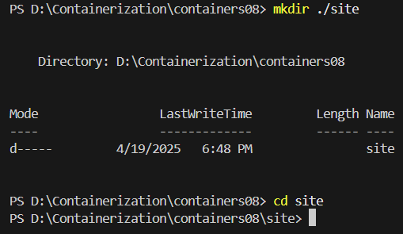

# IWNO8: Integrare continuă cu Github Actions

* **Autor:** Straton Alexandru  
* **Grupa:** IA-2302  
* **Data:** 19.04.2025  

## Scop
Scopul acestei lucrări este familiarizarea cu integrarea continuă utilizând `GitHub Actions`, dezvoltarea competențelor în crearea și testarea unei aplicații web `PHP` cu `SQLite`, precum și înțelegerea modului de configurare a unui flux de lucru automatizat pentru construirea și testarea aplicației într-un container `Docker`.

## Sarcina
Crearea unei aplicații web `PHP` funcționale cu o bază de date `SQLite`, scrierea testelor unitare pentru clasele `Database` și `Page`, și configurarea unui flux de integrare continuă cu `GitHub Actions`. Aplicația va fi construită și testată într-un container `Docker`, utilizând un `Dockerfile` pentru a seta mediul `PHP` și `SQLite`, și un fișier .`github/workflows/main.yml` pentru a automatiza construirea imaginii `Docker` și rularea testelor la fiecare `push` pe ramura `main`.

--- 

### 1. Crearea unui proiect
 - Crearea unui *repository* pe GitHub
    - Tastăm butonul `New`  
        

    - Introducem datele repository-ului  
        

--- 

### 2. Clonarea repository-ului pe calculatorul local

 1. În repository-ul creat tastăm Code -> Local -> Clone -> HTTPS, copiem link-ul.  
        

 2. Deschidem Visual Studio sau alt IDE dorit.  
        

 3. Introducem comanda pentru clonare în consolă

    ```bash
    git clone https://github.com/straton-alex/containers08.git
    cd containers08
    ```

--- 

### 3. Crearea aplicației Web

**1. Crearea structurii proiectului**
- În directorul `containers08` creați directorul `./site`. În directorul `./site` va fi plasată aplicația `Web` pe baza `PHP`.

    ```bash
    mkdir ./site
    cd site
    ```
    

- Creați în directorul `./site` aplicația Web pe baza PHP cu următoarea structură:
    ```
    site
    ├── modules/
    │   ├── database.php
    │   └── page.php
    ├── templates/
    │   └── index.tpl
    ├── styles/
    │   └── style.css
    ├── config.php
    └── index.php
    ```
    

- Fișierul` modules/database.php` conține clasa `Database` pentru lucru cu baza de date. Pentru lucru cu baza de date folosiți `SQLite`. Clasa trebuie să conțină metode:

    - `__construct($path)` - constructorul clasei, primește calea către fișierul bazei de date `SQLite`;

    - `Execute($sql)` - execută interogarea `SQL`;

    - `Fetch($sql)` - execută interogarea `SQL` și returnează rezultatul sub formă de tablou asociativ;

    - `Create($table, $data)` - creează înregistrare în tabelul `$table` cu datele din tabloul asociativ `$data` și returnează identificatorul înregistrării create;

    - `Read($table, $id)` - returnează înregistrarea din tabelul `$table` după identificatorul `$id`;

    - `Update($table, $id, $data)` - actualizează înregistrarea în tabelul `$table` după identificatorul `$id` cu datele din tabloul asociativ `$data`;

    - `Delete($table, $id)` - șterge înregistrarea din tabelul `$table` după identificatorul `$id`;

    - `Count($table)` - returnează numărul înregistrărilor din tabelul `$table`.
        <br>
        > Exemplu `modules/database.php`
        ```php
        <?php

        class Database {
            private $db;

            public function __construct($path) {
                try {
                    $this->db = new PDO("sqlite:$path");
                    $this->db->setAttribute(PDO::ATTR_ERRMODE, PDO::ERRMODE_EXCEPTION);
                } catch (PDOException $e) {
                    throw new Exception("Database connection failed: " . $e->getMessage());
                }
            }

            public function Execute($sql) {
                try {
                    $this->db->exec($sql);
                    return true;
                } catch (PDOException $e) {
                    throw new Exception("Query execution failed: " . $e->getMessage());
                }
            }

            public function Fetch($sql) {
                try {
                    $stmt = $this->db->query($sql);
                    return $stmt->fetchAll(PDO::FETCH_ASSOC);
                } catch (PDOException $e) {
                    throw new Exception("Query fetch failed: " . $e->getMessage());
                }
            }

            public function Create($table, $data) {
                $columns = implode(', ', array_keys($data));
                $placeholders = ':' . implode(', :', array_keys($data));
                $sql = "INSERT INTO $table ($columns) VALUES ($placeholders)";
                
                try {
                    $stmt = $this->db->prepare($sql);
                    foreach ($data as $key => $value) {
                        $stmt->bindValue(":$key", $value);
                    }
                    $stmt->execute();
                    return $this->db->lastInsertId();
                } catch (PDOException $e) {
                    throw new Exception("Create failed: " . $e->getMessage());
                }
            }

            public function Read($table, $id) {
                $sql = "SELECT * FROM $table WHERE id = :id";
                try {
                    $stmt = $this->db->prepare($sql);
                    $stmt->bindValue(':id', $id);
                    $stmt->execute();
                    return $stmt->fetch(PDO::FETCH_ASSOC);
                } catch (PDOException $e) {
                    throw new Exception("Read failed: " . $e->getMessage());
                }
            }

            public function Update($table, $id, $data) {
                $set = [];
                foreach ($data as $key => $value) {
                    $set[] = "$key = :$key";
                }
                $set = implode(', ', $set);
                $sql = "UPDATE $table SET $set WHERE id = :id";
                
                try {
                    $stmt = $this->db->prepare($sql);
                    $stmt->bindValue(':id', $id);
                    foreach ($data as $key => $value) {
                        $stmt->bindValue(":$key", $value);
                    }
                    return $stmt->execute();
                } catch (PDOException $e) {
                    throw new Exception("Update failed: " . $e->getMessage());
                }
            }

            public function Delete($table, $id) {
                $sql = "DELETE FROM $table WHERE id = :id";
                try {
                    $stmt = $this->db->prepare($sql);
                    $stmt->bindValue(':id', $id);
                    return $stmt->execute();
                } catch (PDOException $e) {
                    throw new Exception("Delete failed: " . $e->getMessage());
                }
            }

            public function Count($table) {
                $sql = "SELECT COUNT(*) as count FROM $table";
                try {
                    $stmt = $this->db->query($sql);
                    $result = $stmt->fetch(PDO::FETCH_ASSOC);
                    return $result['count'];
                } catch (PDOException $e) {
                    throw new Exception("Count failed: " . $e->getMessage());
                }
            }
        }
        ```
- Fișierul `modules/page.php` conține clasa `Page` pentru lucru cu paginile. Clasa trebuie să conțină metode:

    - `__construct($template)` - constructorul clasei, primește calea către șablonul paginii;
    - `Render($data)` - afișează pagina, înlocuind datele din tabloul asociativ `$data` în șablon.
        <br>
        > Exemplu`modules/page.php`

        ```php
        <?php

        class Page {
            private $template;

            public function __construct($template) {
                if (!file_exists($template)) {
                    throw new Exception("Template file not found: $template");
                }
                $this->template = $template;
            }

            public function Render($data) {
                $content = file_get_contents($this->template);
                
                foreach ($data as $key => $value) {
                    $content = str_replace("{{{$key}}}", htmlspecialchars($value), $content);
                }
                
                return $content;
            }
        }
        ```
- Fișierul `templates/index.tpl` conține șablonul paginii.
    <br>
    > Exemplu `templates/index.tpl`

    ```html
    <!DOCTYPE html>
    <html lang="en">
    <head>
        <meta charset="UTF-8">
        <title>{{title}}</title>
        <link rel="stylesheet" href="styles/style.css">
    </head>
    <body>
        <header>
            <h1>{{title}}</h1>
        </header>
        <main>
            <div class="content">
                {{content}}
            </div>
        </main>
        <footer>
            <p>{{footer}}</p>
        </footer>
    </body>
    </html>
    ```

- Fișierul `styles/style.css` conține stilurile pentru pagina.
    <br>
    > Exemplu `styles/style.css`

    ```css
    body {
        font-family: Arial, sans-serif;
        margin: 0;
        padding: 0;
        line-height: 1.6;
    }

    header {
        background: #333;
        color: white;
        text-align: center;
        padding: 1rem;
    }

    main {
        max-width: 800px;
        margin: 0 auto;
        padding: 2rem;
    }

    .content {
        background: #f9f9f9;
        padding: 1rem;
        border-radius: 5px;
    }

    footer {
        background: #333;
        color: white;
        text-align: center;
        padding: 1rem;
        position: fixed;
        bottom: 0;
        width: 100%;
    }
    ```
- Fișierul `index.php` conține codul pentru afișarea paginii.
    <br>
    > Exemplu `index.php`

    ```php
    <?php

    require_once __DIR__ . '/modules/database.php';
    require_once __DIR__ . '/modules/page.php';
    require_once __DIR__ . '/config.php';

    try {
        $db = new Database($config["db"]["path"]);
        $page = new Page(__DIR__ . '/templates/index.tpl');

        // Securizare parametru GET
        $pageId = filter_input(INPUT_GET, 'page', FILTER_VALIDATE_INT);
        if ($pageId === false || $pageId === null) {
            throw new Exception("Invalid page ID");
        }

        $data = $db->Read("page", $pageId);
        if (!$data) {
            throw new Exception("Page not found");
        }

        echo $page->Render($data);
    } catch (Exception $e) {
        header("HTTP/1.1 404 Not Found");
        echo "Error: " . htmlspecialchars($e->getMessage());
    }
    ```

- Fișierul `config.php` conține setările pentru conectarea la baza de date.
    <br>
    > Exemplu `config.php`

    ```php
    <?php

    $config = [
        'db' => [
            'path' => __DIR__ . '/database.sqlite'
        ]
    ];
    ```

---
### 4. Pregătirea fișierului SQL pentru baza de date

- Creați în directorul `./site` directorul `./sql`. În directorul creat creați fișierul `schema.sql`

    ```bash
    mkdir sql
    cd sql
    New-Item -ItemType File -Name "schema.sql"
    ```
    
    

    cu următorul conținut:

    ```sql
    CREATE TABLE page (
    id INTEGER PRIMARY KEY AUTOINCREMENT,
    title TEXT,
    content TEXT
    );

    INSERT INTO page (title, content) VALUES ('Page 1', 'Content 1');
    INSERT INTO page (title, content) VALUES ('Page 2', 'Content 2');
    INSERT INTO page (title, content) VALUES ('Page 3', 'Content 3');
    ```

### 5. Crearea testelor

- Creați în rădăcina directorului `containers08` directorul `./tests`. 
    ```bash
    mkdir tests
    cd tests
    ```
    

- În directorul creat creați fișierul `testframework.php`
    ```bash
    New-Item -ItemType File -Name "testframework.php"
    ```
    

    cu următorul conținut:

    ```php
    <?php

    function message($type, $message) {
        $time = date('Y-m-d H:i:s');
        echo "{$time} [{$type}] {$message}" . PHP_EOL;
    }

    function info($message) {
        message('INFO', $message);
    }

    function error($message) {
        message('ERROR', $message);
    }

    function assertExpression($expression, $pass = 'Pass', $fail = 'Fail'): bool {
        if ($expression) {
            info($pass);
            return true;
        }
        error($fail);
        return false;
    }

    class TestFramework {
        private $tests = [];
        private $success = 0;

        public function add($name, $test) {
            $this->tests[$name] = $test;
        }

        public function run() {
            foreach ($this->tests as $name => $test) {
                info("Running test {$name}");
                if ($test()) {
                    $this->success++;
                }
                info("End test {$name}");
            }
        }

        public function getResult() {
            return "{$this->success} / " . count($this->tests);
        }
    }
    ```

- Creați în directorul `./tests` fișierul `tests.php` 

    ```bash
    New-Item -ItemType File -Name "tests.php"
    ```
    

    cu următorul conținut:
    
    ```php
    <?php

    require_once __DIR__ . '/testframework.php';
    require_once __DIR__ . '/../config.php';
    require_once __DIR__ . '/../modules/database.php';
    require_once __DIR__ . '/../modules/page.php';

    $testFramework = new TestFramework();

    // Test 1: Verifică conexiunea la baza de date
    function testDbConnection() {
        global $config;
        try {
            $db = new Database($config["db"]["path"]);
            return true;
        } catch (Exception $e) {
            return false;
        }
    }

    // Test 2: Verifică metoda Count
    function testDbCount() {
        global $config;
        $db = new Database($config["db"]["path"]);
        
        // Creează un tabel temporar pentru test
        $db->Execute("CREATE TABLE test_table (id INTEGER PRIMARY KEY, name TEXT)");
        
        // Testează tabela goală
        $count1 = $db->Count("test_table");
        
        // Adaugă o înregistrare
        $db->Create("test_table", ["name" => "Test"]);
        
        // Verifică dacă numărul a crescut
        $count2 = $db->Count("test_table");
        
        // Curăță
        $db->Execute("DROP TABLE test_table");
        
        return $count1 === 0 && $count2 === 1;
    }

    // Test 3: Verifică metoda Create
    function testDbCreate() {
        global $config;
        $db = new Database($config["db"]["path"]);
        
        $db->Execute("CREATE TABLE test_table (id INTEGER PRIMARY KEY, name TEXT, value INTEGER)");
        
        $data = [
            "name" => "Test Item",
            "value" => 42
        ];
        
        $id = $db->Create("test_table", $data);
        
        // Verifică dacă înregistrarea există
        $result = $db->Read("test_table", $id);
        
        $db->Execute("DROP TABLE test_table");
        
        return $id > 0 && 
            $result["name"] === "Test Item" && 
            $result["value"] === 42;
    }

    // Test 4: Verifică metoda Read
    function testDbRead() {
        global $config;
        $db = new Database($config["db"]["path"]);
        
        $db->Execute("CREATE TABLE test_table (id INTEGER PRIMARY KEY, name TEXT)");
        
        $data = ["name" => "Read Test"];
        $id = $db->Create("test_table", $data);
        
        $result = $db->Read("test_table", $id);
        
        $db->Execute("DROP TABLE test_table");
        
        return $result["name"] === "Read Test";
    }

    // Test 5: Verifică metoda Update
    function testDbUpdate() {
        global $config;
        $db = new Database($config["db"]["path"]);
        
        $db->Execute("CREATE TABLE test_table (id INTEGER PRIMARY KEY, name TEXT, value INTEGER)");
        
        $data = [
            "name" => "Initial",
            "value" => 1
        ];
        $id = $db->Create("test_table", $data);
        
        $updateData = [
            "name" => "Updated",
            "value" => 2
        ];
        
        $db->Update("test_table", $id, $updateData);
        $result = $db->Read("test_table", $id);
        
        $db->Execute("DROP TABLE test_table");
        
        return $result["name"] === "Updated" && $result["value"] === 2;
    }

    // Test 6: Verifică metoda Delete
    function testDbDelete() {
        global $config;
        $db = new Database($config["db"]["path"]);
        
        $db->Execute("CREATE TABLE test_table (id INTEGER PRIMARY KEY, name TEXT)");
        
        $data = ["name" => "To Delete"];
        $id = $db->Create("test_table", $data);
        
        $db->Delete("test_table", $id);
        $result = $db->Read("test_table", $id);
        
        $db->Execute("DROP TABLE test_table");
        
        return $result === false;
    }

    // Test 7: Verifică metoda Execute
    function testDbExecute() {
        global $config;
        $db = new Database($config["db"]["path"]);
        
        try {
            $db->Execute("CREATE TABLE test_table (id INTEGER PRIMARY KEY)");
            $db->Execute("INSERT INTO test_table (id) VALUES (1)");
            $db->Execute("DROP TABLE test_table");
            return true;
        } catch (Exception $e) {
            return false;
        }
    }

    // Test 8: Verifică metoda Fetch
    function testDbFetch() {
        global $config;
        $db = new Database($config["db"]["path"]);
        
        $db->Execute("CREATE TABLE test_table (id INTEGER PRIMARY KEY, name TEXT)");
        
        $data = [
            ["name" => "Item 1"],
            ["name" => "Item 2"]
        ];
        
        foreach ($data as $item) {
            $db->Create("test_table", $item);
        }
        
        $results = $db->Fetch("SELECT * FROM test_table");
        
        $db->Execute("DROP TABLE test_table");
        
        return count($results) === 2 && 
            $results[0]["name"] === "Item 1" && 
            $results[1]["name"] === "Item 2";
    }

    // Test 9: Verifică constructorul Page
    function testPageConstruct() {
        try {
            $page = new Page(__DIR__ . '/../templates/index.tpl');
            return true;
        } catch (Exception $e) {
            return false;
        }
    }

    // Test 10: Verifică metoda Render
    function testPageRender() {
        $page = new Page(__DIR__ . '/../templates/index.tpl');
        
        $data = [
            "title" => "Test Title",
            "content" => "Test Content",
            "footer" => "Test Footer"
        ];
        
        $output = $page->Render($data);
        
        return strpos($output, "Test Title") !== false &&
            strpos($output, "Test Content") !== false &&
            strpos($output, "Test Footer") !== false;
    }

    // Adaugă testele
    $testFramework->add('Database connection', 'testDbConnection');
    $testFramework->add('Table count', 'testDbCount');
    $testFramework->add('Data create', 'testDbCreate');
    $testFramework->add('Data read', 'testDbRead');
    $testFramework->add('Data update', 'testDbUpdate');
    $testFramework->add('Data delete', 'testDbDelete');
    $testFramework->add('Query execute', 'testDbExecute');
    $testFramework->add('Query fetch', 'testDbFetch');
    $testFramework->add('Page construction', 'testPageConstruct');
    $testFramework->add('Page rendering', 'testPageRender');

    // Rulează testele
    $testFramework->run();

    echo $testFramework->getResult();
    ```

### 6. Crearea Dockerfile
- Creați în directorul rădăcină (`containers08`) al proiectului fișierul `Dockerfile` 
    ```bash
    cd ..
    New-Item -ItemType File -Name "Dockerfile"
    ```
    

    cu următorul conținut:
    ```docker
    FROM php:7.4-fpm as base

    RUN apt-get update && \
        apt-get install -y sqlite3 libsqlite3-dev && \
        docker-php-ext-install pdo_sqlite

    VOLUME ["/var/www/db"]

    COPY site/sql/schema.sql /var/www/db/schema.sql

    RUN echo "prepare database" && \
        cat /var/www/db/schema.sql | sqlite3 /var/www/db/db.sqlite && \
        chmod 777 /var/www/db/db.sqlite && \
        rm -rf /var/www/db/schema.sql && \
        echo "database is ready"

    COPY site /var/www/html
    ```
---

### 7. Configurarea Github Actions

- Creați în directorul rădăcină (`containers08`) al proiectului fișierul `.github/workflows/main.yml` 

    ```bash
    New-Item -Path ".github/workflows" -ItemType Directory -Force
    New-Item -Path ".github/workflows\main.yml" -ItemType File -Force
    ```
    

    cu următorul conținut:

    ```yml
    name: CI

    on:
    push:
        branches:
        - main

    jobs:
    build:
        runs-on: ubuntu-latest
        steps:
        - name: Checkout
            uses: actions/checkout@v4
        - name: Build the Docker image
            run: docker build -t containers08 .
        - name: Create `container`
            run: docker create --name container --volume database:/var/www/db containers08
        - name: Copy tests to the container
            run: docker cp ./tests container:/var/www/html
        - name: Up the container
            run: docker start container
        - name: Run tests
            run: docker exec container php /var/www/html/tests/tests.php
        - name: Stop the container
            run: docker stop container
        - name: Remove the container
            run: docker rm container
    ```


---
### 6. Testarea aplicației
- Trimiteți modificările în repozitoriul și asigurați-vă că testele trec cu succes. 

    ```bash
    git add .
    git commit -m "add GitHub Actions workflow and tests"
    git push origin main
    ```

    

- Pentru aceasta, treceți la fila `Actions` în repozitoriu și așteptați finalizarea sarcinii.

    

    

### 7. Publicarea codului pe GitHub

> Publicăm codul pe GitHub

```bash
# adăugăm toate fișierele pentru tracking
git add .
# creăm un commit
git commit -m "lab08"
# împingem în branch-ul principal
git push origin main
```

--- 

### 8. Răspunsuri la întrebări

1. **Ce este integrarea continuă?**

    - `Integrarea continuă (CI)` este o practică în dezvoltarea `software` în care modificările de cod sunt integrate frecvent într-un `repository` central, fiind `automat construite` și `testate` pentru a detecta rapid erorile. Scopul este îmbunătățirea calității, reducerea riscurilor și accelerarea dezvoltării prin feedback rapid și automatizare.
  
2. **Pentru ce sunt necesare testele unitare? Cât de des trebuie să fie executate?**

   - `Testele unitare` verifică dacă bucăți mici de cod (funcții, metode) `funcționează` corect, ajută la găsirea erorilor, îmbunătățesc calitatea și ușurează modificările.

    - `Cât de des?` Rulează-le la fiecare schimbare de cod (`commit/push`), automat prin `CI` (ex. `GitHub Actions`), și local `înainte` de `commit`.

3. **Care modificări trebuie făcute în fișierul `.github/workflows/main.yml` pentru a rula testele la fiecare solicitare de trage (Pull Request)?**

   - Pentru a configura fișierul `.github/workflows/main.yml `astfel încât testele să ruleze și la fiecare solicitare de tragere (`Pull Request`), trebuie să adăugați evenimentul `pull_request` în secțiunea on a fluxului de lucru. În prezent, fluxul rulează doar la `push `pe ramura `main`. Adăugând `pull_request`, testele vor fi declanșate și atunci când se creează sau se actualizează un pull request către ramura` main`:

        - Exemplu
            - Actualizați secțiunea on din fișierul `.github/workflows/main.yml` pentru a include `pull_request` alături de `push`:
                ```yml
                name: CI

                on:
                push:
                    branches:
                    - main
                pull_request:
                    branches:
                    - main

                jobs:
                build:
                    runs-on: ubuntu-latest
                    steps:
                    - name: Checkout
                        uses: actions/checkout@v4
                    - name: Build the Docker image
                        run: docker build -t containers08 .
                    - name: Create `container`
                        run: docker create --name container --volume database:/var/www/db containers08
                    - name: Copy tests to the container
                        run: docker cp ./tests container:/var/www/html
                    - name: Up the container
                        run: docker start container
                    - name: Run tests
                        run: docker exec container php /var/www/html/tests/tests.php
                    - name: Stop the container
                        run: docker stop container
                    - name: Remove the container
                        run: docker rm container
                ```
            - După actualizarea fișierului, comiteți și împingeți schimbările:

                ```bash
                git add .github/workflows/main.yml
                git commit -m "Add pull_request trigger to GitHub Actions workflow"
                git push origin main
                ```
            - Testare
                - Creați un `pull request` către ramura `main` (e.g., dintr-o ramură de `feature`).
                - Verificați tab-ul `Actions` în repository-ul `GitHub` pentru a vedea dacă fluxul de lucru rulează și testele trec.


4. **Ce trebuie adăugat în fișierul .github/workflows/main.yml pentru a șterge imaginile create după testare?**

    - Pentru a șterge imaginile `Docker` create după testare în fluxul de lucru `GitHub Actions` definit în fișierul `.github/workflows/main.yml`, trebuie să adăugați un pas suplimentar în job-ul `build` care rulează comanda `docker image rm` pentru a elimina imaginea `containers08` după ce testele sunt finalizate și containerul este oprit și șters. Acest pas asigură că spațiul pe runner-ul `GitHub Actions `este eliberat și că nu rămân imagini inutile.

        ```yml
        - name: Remove the Docker image
        run: docker image rm containers08
        ```

        - Cum să actualizați fișierul local?
            - Actualizați fișierul `.github/workflows/main.yml`:

                ```yml
                name: CI

                on:
                push:
                    branches:
                    - main
                pull_request:
                    branches:
                    - main

                jobs:
                build:
                    runs-on: ubuntu-latest
                    steps:
                    - name: Checkout
                        uses: actions/checkout@v4
                    - name: Build the Docker image
                        run: docker build -t containers08 .
                    - name: Create `container`
                        run: docker create --name container --volume database:/var/www/db containers08
                    - name: Copy tests to the container
                        run: docker cp ./tests container:/var/www/html
                    - name: Up the container
                        run: docker start container
                    - name: Run tests
                        run: docker exec container php /var/www/html/tests/tests.php
                    - name: Stop the container
                        run: docker stop container
                    - name: Remove the container
                        run: docker rm container
                    - name: Remove the Docker image
                        run: docker image rm containers08
                ```
            - După actualizarea fișierului, comiteți și împingeți schimbările:

                ```bash
                git add .github/workflows/main.yml
                git commit -m "Add Docker image cleanup in GitHub Actions workflow"
                git push origin main
                ```
            - Testare
                - După ce împingeți modificările, verificați tab-ul `Actions` în repository-ul `GitHub` pentru a confirma că fluxul rulează.
                - La finalul execuției, pasul `Remove the Docker image` ar trebui să apară în log-uri, iar imaginea `containers08` va fi ștearsă de pe runner.

    
--- 
### 9. Concluzie

- Această lucrare a oferit o experiență practică în configurarea integrării continue utilizând `GitHub Actions`, consolidând competențele în dezvoltarea și testarea aplicațiilor web `PHP` cu `Docker`. Am învățat să:

    - Creez o aplicație web `PHP` cu o bază de date `SQLite`, structurată cu clasele `Database` și `Page` pentru gestionarea datelor și afișarea paginilor.
    - Scriu `teste unitare` comprehensive pentru toate metodele claselor `Database` și `Page`, utilizând un cadru de testare personalizat (`TestFramework`).
    - Configurez un `Dockerfile` pentru a construi o imagine `Docker` care include `PHP`, `SQLite` și `aplicația web`, cu inițializarea automată a bazei de date.
    - Setez un flux de lucru `GitHub Actions` (`.github/workflows/main.yml`) pentru a automatiza construirea imaginii `Docker`, rularea testelor și curățarea resurselor (containere și imagini) la fiecare `push` sau `pull request` pe ramura `main`.

- Rezultatul final a fost o aplicație `PHP` funcțională, testată automat într-un mediu `Docker`, cu un proces `CI` care:

    - Asigură calitatea codului prin teste unitare executate la fiecare modificare.
    - Optimizează utilizarea resurselor prin ștergerea imaginilor și containerelor după testare.
    - Facilitează colaborarea prin rularea testelor pe pull request-uri.

Această abordare demonstrează avantajele integrării continue cu `GitHub Actions` pentru `dezvoltarea rapidă`, `testarea automată` și `livrarea fiabilă` a `aplicațiilor web`.

--- 

### 10. Bibliografie

*1. Curs Moodle USM, Containerizarea și Virtualizarea*

*2. Documentația oficială Docker – https://docs.docker.com/*

*3. Markdown Guide – https://www.markdownguide.org/*
